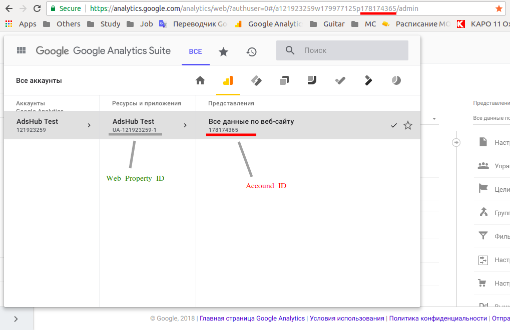
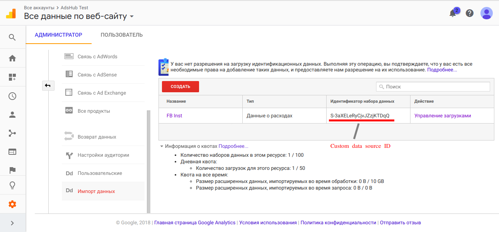

# User Guide

## How to setup GA export script

1. Create account in https://analytics.google.com/
2. Open administrator's panel via button with gear icon in left menu
3. Click on breadcrumbs in left-top corner of page to see account_id and web_property_id

4. Click on "Data import" button in resource's section (center section between "account" and "view")
5. Create new data-set
6. Copy custom_data_source_id which will have generated for you data-set

7. Use this values for GA export